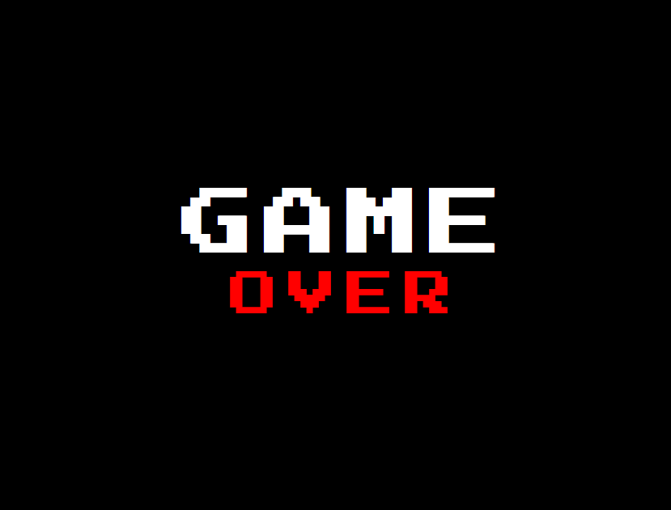

# Animation de texte rétro en CSS

## Description
Ancien projet d'animation de texte en CSS (circa 2019).  
Ce projet applique une animation rétro à deux lignes de texte à l'aide de `@keyframes`, avec un effet de zoom et de variation d'espacement.

## Technologies utilisées
- HTML5  
- CSS3 (animations, `transform`, `keyframes`)  
- Police : [Press Start 2P](https://fonts.google.com/specimen/Press+Start+2P)

## Aperçu

## Ce que j'ai appris
- Centrage précis d’un élément avec `position: absolute` et `transform: translate(-50%, -50%)`  
- Utilisation de `@keyframes` pour créer des animations d’apparition  
- Contrôle des propriétés comme `letter-spacing`, `margin-bottom` et `color` dans une animation

## Remarques
Un petit projet rétro fait au tout début de mon apprentissage du CSS.  
Simple mais efficace pour comprendre la base des animations et des effets typographiques.

## Démo

👉 [Voir la démo sur GitHub Pages](https://rukendogan.github.io/gameOver_css/)
